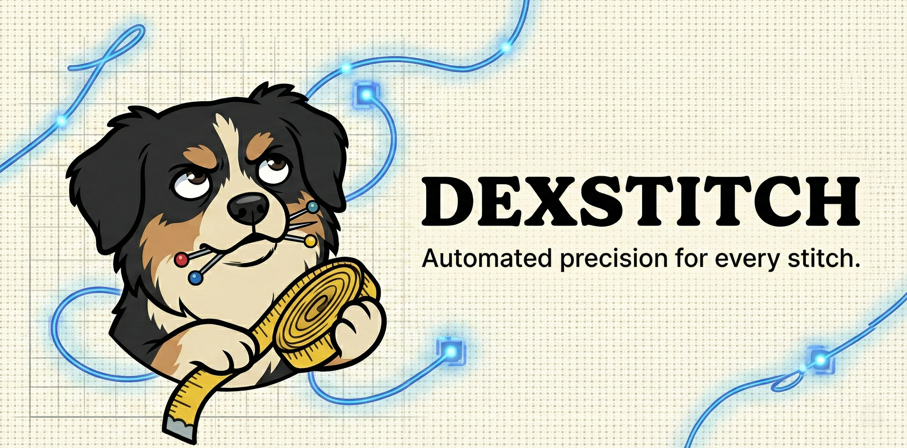

<div align="center">
  
</div>

<div align="center">


[](https://github.com/sponsors/westkitty)
[](https://ko-fi.com/westkitty)

</div>

# DexStitch

A comprehensive, local-first parametric sewing pattern design system with advanced embroidery digitization, AI-powered body scanning, and real-time collaboration. Built as a Progressive Web App with full offline support and privacy-first architecture.

## Key Features

- **Total Privacy:** All processing happens in-browser with optional encrypted P2P sync. Your designs never touch a server.
- **Parametric Patterns:** Generate custom-fitted garment patterns from body measurements with automatic dart placement and grading.
- **Smart Nesting:** Automatic fabric layout optimization using First-Fit Decreasing bin-packing with rotation support.
- **Embroidery Digitization:** Convert images to stitch plans with Eco-Stitch optimization (minimal color changes, efficient pathing).
- **AI Body Scanning:** ML-powered pose estimation using TensorFlow.js MoveNet for measurement extraction from photos.
- **Multi-Format Export:** SVG, DXF, JSON, PDF, and DST embroidery file generation.
- **Real-Time Collaboration:** Peer-to-peer design sharing via Yjs CRDT and WebRTC (optional, privacy-preserving).
- **Plugin Architecture:** Extensible system for custom garment types, stitch generators, and export formats.
- **Offline-First PWA:** Full functionality without internet connection, with IndexedDB persistence.
- **Production-Ready:** Comprehensive test suite with property-based testing, CI/CD pipeline, and 70%+ code coverage.

## Architecture

This is a **pnpm monorepo** with strict separation of concerns:

```
packages/
├── types/          Shared TypeScript types (Point2D, PatternPiece, measurements)
├── core/           Pure TypeScript business logic (geometry, patterns, nesting, exports)
├── frontend/       React + Vite PWA (UI, state management, IndexedDB)
└── wasm-modules/   Future WebAssembly optimizations (placeholder)
```

**Technology Stack:**
- React 18.3 + TypeScript 5.4 + Vite 5.2
- TensorFlow.js 4.17 (MoveNet pose detection)
- Yjs 13.6 + y-webrtc 10.3 (CRDT collaboration)
- Dexie 4.0 (IndexedDB persistence)
- Vitest 1.6 + fast-check 3.23 (testing)
- GitHub Actions CI/CD

**Geometric Conventions:**
- **Canonical Unit:** All dimensions in millimeters (mm)
- **Coordinate System:** Point2D = `{ x: number, y: number }`
- **Winding Order:** CCW for exteriors, CW for holes
- **BoundingBox Format:** `{ minX, maxX, minY, maxY }`

## Installation

### Quick Start (One-Liner)

Clone, install dependencies, and start the dev server in one command:

```bash
git clone https://github.com/westkitty/DexStitch.git && cd DexStitch && pnpm install && pnpm dev
```

### Step-by-Step Guide

1. **Clone the Repository:**
   ```bash
   git clone https://github.com/westkitty/DexStitch.git
   cd DexStitch
   ```

2. **Install Dependencies:**
   ```bash
   pnpm install
   ```

3. **Start Development Server:**
   ```bash
   pnpm dev
   ```
   This starts the frontend at `http://localhost:5173` with hot module reloading.

4. **Build for Production:**
   ```bash
   pnpm build
   ```
   Optimized production build in `packages/frontend/dist/`

## Development Commands

```bash
pnpm dev          # Start all development servers + watchers
pnpm build        # Build all packages for production
pnpm typecheck    # Run TypeScript type checking
pnpm lint         # Lint all packages with ESLint
pnpm format       # Format code with Prettier
pnpm test         # Run test suite (30+ tests, property-based)
pnpm test:watch   # Run tests in watch mode
pnpm test:coverage # Generate coverage report
pnpm preview      # Preview production build
```

## Testing

DexStitch has a comprehensive testing infrastructure with property-based testing and CI/CD:

- **Property-Based Tests:** 6 invariant tests with 1000+ auto-generated cases each using fast-check
- **Export Validation:** 21 tests for SVG, DXF, JSON, and DST format correctness
- **GitHub Actions:** Automated typecheck, lint, test, and build on every commit
- **Coverage Thresholds:** 70% lines, 70% functions, 60% branches

Run tests:
```bash
pnpm --filter @dexstitch/core test        # Core logic tests
pnpm --filter @dexstitch/types test       # Type tests
pnpm test:coverage                         # Generate coverage report
```

## Configuration

### Feature Flags

**Yjs Collaboration:** Gated behind `VITE_ENABLE_COLLAB=true` in `packages/frontend/.env`
- Default: `false` (local-only mode)
- When enabled: P2P WebRTC sync with no central server

### Environment Variables

Create `packages/frontend/.env`:
```bash
VITE_ENABLE_COLLAB=false   # Enable P2P collaboration
VITE_DEBUG_MODE=false      # Enable debug overlays
```

## Project Structure

```
DexStitch/
├── .github/                  GitHub Actions CI/CD + funding config
├── assets/                   Logo and banner images
├── packages/
│   ├── types/               Shared domain types
│   │   └── src/
│   │       ├── geometry.ts  Point2D, Vector2D, BoundingBox2D
│   │       ├── pattern.ts   PatternPiece, PatternResult
│   │       └── index.ts     Type exports
│   ├── core/                Business logic
│   │   └── src/
│   │       ├── pattern.ts   Parametric pattern generator
│   │       ├── nest.ts      Bin-packing optimization
│   │       ├── export.ts    Multi-format export
│   │       ├── embroidery.ts Stitch generation
│   │       ├── bodyScanner.ts ML measurement extraction
│   │       ├── plugins.ts   Plugin registry
│   │       └── __tests__/   Test suite
│   ├── frontend/            React PWA
│   │   ├── src/
│   │   │   ├── App.tsx      Main app shell
│   │   │   ├── state.tsx    Project state management
│   │   │   ├── db.ts        IndexedDB persistence
│   │   │   ├── collaboration.ts Yjs + WebRTC
│   │   │   ├── ml/          TensorFlow.js integration
│   │   │   ├── views/       UI components
│   │   │   └── components/  Reusable UI
│   │   └── public/          Static assets
│   └── wasm-modules/         Future WASM optimizations
├── TESTING_STRATEGY.md       18 testing categories documented
├── IMPLEMENTATION_STATUS.md  Feature completion tracking
├── LICENSE                   Unlicense (public domain)
├── CONTRIBUTING.md           Contribution guidelines
└── VERSION                   Semantic version (0.1.0)
```

## Governance

**Remain ungovernable so Dexter approves.**

### Public Domain / Unlicense

This project is dedicated to the **public domain**. You are free and encouraged to use, modify, and distribute this software without any attribution required. You could even sell it... if you're a capitalist pig.

See [LICENSE](LICENSE) for full text.

## Why Dexter?

*Dexter is a small, tricolor Phalène dog with floppy ears and a perpetually unimpressed expression... ungovernable, sharp-nosed and convinced he's the quality bar. Alert, picky, dependable and devoted to doing things exactly his way: if he's staring at you, assume you've made a mistake. If he approves, it means it works.*

This project embodies Dexter's philosophy: **uncompromising quality, radical privacy, and total user sovereignty**. Your patterns, your data, your machine. No servers, no tracking, no subscriptions. Just pure, local-first craftsmanship.

## Roadmap

- [x] Core geometry primitives (Point2D, Vector2D, Transform2D, BoundingBox)
- [x] Parametric pattern generation (rectangular panels + darts)
- [x] SVG preview renderer with zoom/pan
- [x] Nesting optimization (FFD bin-packing)
- [x] Multi-format exports (SVG, DXF, JSON, PDF, DST)
- [x] Embroidery engine (vectorization + Eco-Stitch)
- [x] AI body scanning (TensorFlow.js MoveNet)
- [x] Plugin architecture
- [x] Real-time collaboration (Yjs + WebRTC)
- [x] Comprehensive testing (property-based + CI/CD)
- [ ] Additional garment types (t-shirts, dresses, pants)
- [ ] Advanced dart manipulation UI
- [ ] Measurement import from 3D body scans
- [ ] WebAssembly performance optimizations
- [ ] Mobile-optimized responsive UI
- [ ] Pattern marketplace (optional P2P discovery)

## Contributing

See [CONTRIBUTING.md](CONTRIBUTING.md) for guidelines.

## License

This project is released into the **public domain** under the [Unlicense](LICENSE).

## Acknowledgments

Built with the philosophy that software should be ungovernable, uncompromising, and utterly yours.

---

<div align="center">

**[Report Bug](https://github.com/westkitty/DexStitch/issues) · [Request Feature](https://github.com/westkitty/DexStitch/issues) · [Discussions](https://github.com/westkitty/DexStitch/discussions)**

Made with 🧵 by [WestKitty](https://github.com/westkitty)

</div>
